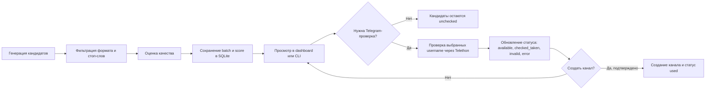

<h1 align="center">Username Studio</h1>

<p align="center">
  Локальная студия для генерации, оценки, проверки и учета коротких Telegram username.
</p>

<p align="center">
  <a href="https://www.python.org/"></a>
  <a href="https://docs.telethon.dev/"></a>
  <a href="https://www.sqlite.org/"></a>
  <a href="https://lmstudio.ai/"></a>
  
</p>

---

**Username Studio** помогает находить короткие Telegram username, оценивать их качество, сохранять историю, проверять доступность через Telegram и аккуратно вести список уже использованных вариантов.

Проект сделан как локальный инструмент: данные лежат на вашей машине, Telegram подключается только когда вы явно запускаете live-действие, а безопасные режимы позволяют генерировать и анализировать кандидатов без Telegram-запросов.

## Содержание

- [Что умеет проект](#что-умеет-проект)
- [Быстрый старт](#быстрый-старт)
- [Установка вручную](#установка-вручную)
- [Настройка `.env`](#настройка-env)
- [Режимы запуска](#режимы-запуска)
- [Как устроен workflow](#как-устроен-workflow)
- [Live Telegram-проверка через аккаунт](#live-telegram-проверка-через-аккаунт)
- [Безопасность Telegram-действий](#безопасность-telegram-действий)
- [База данных и статусы](#база-данных-и-статусы)
- [Структура проекта](#структура-проекта)
- [Частые проблемы](#частые-проблемы)
- [Публикация на GitHub](#публикация-на-github)

## Что умеет проект

| Направление | Описание |
|---|---|
| Генерация | Создает username через LM Studio OpenAI-compatible API. |
| Fallback-генерация | Продолжает работать, даже если LM Studio выключен. |
| Оценка | Считает score по readability, brandability, meaning и rarity. |
| Фильтрация | Пропускает только текущий формат проекта: `5-6` символов, lowercase latin `[a-z]`. |
| Telegram-проверка | Проверяет доступность выбранных кандидатов через Telethon. |
| Создание каналов | Может создать Telegram-канал для подтвержденного доступного username. |
| SQLite-учет | Хранит batch, score, статусы, проверки и использованные username. |
| Web-интерфейс | Открывает локальную dashboard-страницу в браузере. |
| CLI-режим | Сохраняет старое консольное меню для работы из терминала. |
| Логи | Пишет подробный лог в `logs/logs.txt`. |

Типы генерации:

| Тип | Что означает |
|---|---|
| `brandable` | Короткие искусственные имена, похожие на бренд. |
| `russian_transliteration` | Латинские username, вдохновленные русскими словами или звучанием. |
| `multilingual` | Короткие варианты, вдохновленные словами из разных языков. |

## Быстрый старт

Самый простой запуск на Windows:

```powershell
.\START.bat
```

`START.bat` делает всю рутину сам:

- переходит в папку проекта;
- создает `venv`, если окружения еще нет;
- создает `.env` из `.env.example`, если файла настроек еще нет;
- ставит зависимости при первом запуске или после изменения `requirements.txt`;
- включает UTF-8 для нормального вывода русского текста;
- запускает приложение через `main.py`.

Безопасная проверка без Telegram:

```powershell
.\START.bat --no-telegram --dry-run --stats
```

Старое консольное меню:

```powershell
.\START.bat --cli
```

## Установка вручную

Если нужен ручной запуск без `START.bat`:

```powershell
python -m venv venv
.\venv\Scripts\Activate.ps1
pip install -r requirements.txt
copy .env.example .env
python main.py
```

Минимальные требования:

| Что нужно | Для чего |
|---|---|
| Python 3.10+ | Запуск Python-приложения. |
| LM Studio | Локальная LLM-генерация и оценка, опционально. |
| Telegram API credentials | Только для live-проверок и создания каналов. |
| Windows PowerShell | Основной поддерживаемый shell для launcher/publish скриптов. |

Зависимости проекта:

```text
telethon
requests
Unidecode
python-dotenv
```

## Настройка `.env`

Скопируйте `.env.example` в `.env` и заполните только нужные поля.

```env
TELEGRAM_API_ID=
TELEGRAM_API_HASH=
TELEGRAM_PHONE=
TELEGRAM_DRY_RUN=1

LM_STUDIO_URL=http://127.0.0.1:1234/v1
LM_STUDIO_MODEL=local-model
LLM_TEMPERATURE=0.95
LLM_MAX_TOKENS=2000

LOG_LEVEL=INFO
```

| Переменная | Когда нужна | Описание |
|---|---|---|
| `TELEGRAM_API_ID` | Live Telegram mode | API ID из `https://my.telegram.org/`. |
| `TELEGRAM_API_HASH` | Live Telegram mode | API hash из Telegram. Не публиковать. |
| `TELEGRAM_PHONE` | Live Telegram mode | Телефон аккаунта для Telethon-сессии. |
| `TELEGRAM_DRY_RUN` | Рекомендуется | `1` включает preview-режим без реальных Telegram-действий. |
| `LM_STUDIO_URL` | Опционально | URL OpenAI-compatible сервера LM Studio. |
| `LM_STUDIO_MODEL` | Опционально | Имя модели, которое отправляется в LM Studio. |
| `LLM_TEMPERATURE` | Опционально | Температура генерации. |
| `LLM_MAX_TOKENS` | Опционально | Лимит токенов ответа LLM. |
| `LOG_LEVEL` | Опционально | Уровень логирования. |

Telegram API-ключи создаются здесь:

```text
https://my.telegram.org/
```

LM Studio обычно запускает OpenAI-compatible API здесь:

```text
http://localhost:1234/v1
```

Если LM Studio недоступен, проект использует fallback-генерацию и fallback-оценку.

## Режимы запуска

| Команда | Что делает | Telegram |
|---|---|---|
| `.\START.bat` | Запускает локальный web-интерфейс. | Только при выбранном live-действии. |
| `.\START.bat --cli` | Открывает старое консольное меню. | Только в пунктах Telegram. |
| `.\START.bat --no-telegram --dry-run` | Безопасный preview-режим. | Полностью отключен. |
| `.\START.bat --no-telegram --dry-run --stats` | Показывает статистику и выходит. | Полностью отключен. |
| `python main.py` | Запуск web-интерфейса напрямую. | Как в обычном режиме. |
| `python main.py --cli` | CLI-меню напрямую. | Как в CLI. |
| `python web_app.py` | Web-интерфейс напрямую. | Как в web-режиме. |

По умолчанию web-интерфейс открывается локально:

```text
http://127.0.0.1:8080
```

Порт можно изменить:

```powershell
python main.py --host 127.0.0.1 --port 8090
```

## Как устроен workflow



Рекомендуемый порядок работы:

1. Сгенерировать и оценить batch.
2. Посмотреть лучшие варианты в dashboard или статистике.
3. Сначала выполнить Telegram preview в dry-run.
4. Проверить live только небольшую выбранную группу.
5. Создавать канал только для подтвержденного `available` username.

## Live Telegram-проверка через аккаунт

Вкладка **Telegram** в web-интерфейсе сначала работает в безопасном preview-режиме. Чтобы реально проверять username через Telegram-аккаунт, нужно один раз настроить API и авторизовать сессию.

### 1. Заполнить Telegram API

В блоке **Telegram API** укажите реальные данные с `https://my.telegram.org/`:

| Поле в интерфейсе | Что вставить |
|---|---|
| `API ID` | Значение `TELEGRAM_API_ID`, это число. |
| `API HASH` | Значение `TELEGRAM_API_HASH`. |
| `Телефон` | Номер Telegram-аккаунта, например `+79990000000`. |

После заполнения нажмите **Сохранить API**. Данные будут записаны в локальный `.env`.

Если слева отображается `not configured` и текст `TELEGRAM_API_ID/TELEGRAM_API_HASH не заданы в .env`, live-проверка еще не готова: сначала нужно сохранить настоящий API ID и API HASH.

### 2. Войти по Telegram-коду

После сохранения API:

1. В блоке **Вход по коду** проверьте телефон.
2. Нажмите **Отправить код**.
3. Введите код, который придет в Telegram.
4. Нажмите **Войти**.
5. Если на аккаунте включен 2FA-пароль, введите его и нажмите **Подтвердить 2FA**.

Live-проверка доступна только после успешной авторизации Telethon-сессии.

### 3. Preview и live-режим

На вкладке Telegram есть галочка **dry-run**:

| `dry-run` | Что произойдет |
|---|---|
| Включен | Telegram реально не трогается. Кнопка делает только preview выбранных username. |
| Выключен | Будет реальный Telegram-запрос через авторизованный аккаунт. |

Для live-проверки нужно:

1. Снять галочку **dry-run**.
2. В поле **Live confirm** написать ровно:
   ```text
   CHECK
   ```
3. Нажать **Проверить выбранные live**.

`CHECK` нужен как защита от случайного live-запроса. Без него приложение не отправит реальные проверки в Telegram.

## Безопасность Telegram-действий

Telegram-действия сделаны осторожными и явными.

| Механизм | Зачем нужен |
|---|---|
| Ленивое подключение Telegram | Простой запуск приложения не подключается к Telegram. |
| `--no-telegram` | Полностью отключает Telegram-действия. |
| `dry-run` | Показывает, что будет сделано, без реальных запросов. |
| Локальная валидация | Отсекает username вне формата проекта. |
| Проверка статуса в базе | Не дает повторно использовать `used`, `invalid`, `checked_taken`. |
| Подтверждение перед созданием | Канал создается только после явного подтверждения. |
| FloodWait handling | Ограничивает повторы после Telegram rate-limit. |

Проект не предназначен для агрессивной массовой проверки Telegram. Проверяйте небольшие списки и учитывайте лимиты Telegram.

## База данных и статусы

Локальная база:

```text
username_database.db
```

Основные таблицы:

| Таблица | Назначение |
|---|---|
| `checked_usernames` | Результаты Telegram-проверок и текущий статус. |
| `used_usernames` | Username, уже использованные для созданных каналов. |
| `scores` | Последние оценки username. |
| `batches` | Метаданные batch-генераций. |
| `batch_usernames` | Состав username внутри batch. |

Статусы username:

| Статус | Значение |
|---|---|
| `unchecked` | Есть локальная оценка или batch, Telegram еще не проверялся. |
| `checked_taken` | Telegram показал, что username занят или недоступен. |
| `available` | Telegram показал, что username доступен. |
| `used` | Username уже использован для канала. |
| `invalid` | Telegram или локальный фильтр признал username невалидным. |
| `error` | Проверка завершилась ошибкой, например после FloodWait retries. |

Не удаляйте `username_database.db`, если хотите сохранить историю.

## Структура проекта

| Файл | Назначение |
|---|---|
| `START.bat` | Запуск проекта одним файлом на Windows. |
| `main.py` | Главная точка входа, переключение web/CLI, основной workflow. |
| `web_app.py` | Локальная browser dashboard и HTTP API. |
| `config.py` | Загрузка `.env` и константы проекта. |
| `llm_generator.py` | LLM-генерация и fallback-генерация username. |
| `llm_evaluator.py` | LLM-оценка и fallback-оценка. |
| `username_filter.py` | Валидация, blacklist, удаление дублей. |
| `telegram_client.py` | Telethon-проверки и создание каналов. |
| `storage.py` | SQLite-схема, миграции, записи, статистика. |
| `logger.py` | Логи в консоль и `logs/logs.txt`. |
| `utils.py` | Общие функции нормализации, валидации и helpers. |
| `requirements.txt` | Python-зависимости. |
| `.env.example` | Безопасный шаблон настроек. |
| `publish_to_github.ps1` | Скрипт безопасной публикации на GitHub. |

Локальные и приватные файлы исключены из Git:

```text
.env
*.session
*.db
*.bak
logs/
qa_screenshots/
venv/
__pycache__/
```

## Частые проблемы

### Русский текст сломан в консоли

Используйте `START.bat`: он включает UTF-8 автоматически.

При ручном запуске:

```powershell
chcp 65001
$env:PYTHONUTF8 = "1"
$env:PYTHONIOENCODING = "utf-8"
python main.py
```

### LM Studio не отвечает

Проверьте, что включен OpenAI-compatible server:

```text
http://localhost:1234/v1
```

Без LM Studio проект продолжит работать через fallback-логику, но качество генерации и оценки будет проще.

### Telegram login не проходит

Проверьте `.env`:

```env
TELEGRAM_API_ID=
TELEGRAM_API_HASH=
TELEGRAM_PHONE=
```

Если локальная Telethon-сессия устарела, используйте reset session в dashboard или удаляйте session-файл только когда готовы войти заново.

### Нужно просто безопасно посмотреть данные

```powershell
.\START.bat --no-telegram --dry-run --stats
```

или:

```powershell
.\START.bat --no-telegram --dry-run
```

### Посмотреть последние логи

```powershell
Get-Content logs\logs.txt -Tail 100
```

## Публикация на GitHub

Репозиторий можно публиковать только без локальных секретов и данных.

Перед push убедитесь, что в staged files нет:

```text
.env
telegram_session.session
username_database.db
*.bak
logs/
qa_screenshots/
venv/
```

В проекте есть helper, который проверяет staged-файлы:

```powershell
.\publish_to_github.ps1
```

Коммит и публикация:

```powershell
.\publish_to_github.ps1 -RepoUrl "https://github.com/sattop/username-studio.git" -Commit -Push
```

## Текущие настройки по умолчанию

| Настройка | Значение |
|---|---|
| Длина username | `5-6` символов |
| Алфавит username | lowercase latin `[a-z]` |
| Score threshold | `6.0` |
| База данных | `username_database.db` |
| Логи | `logs/logs.txt` |
| Web host | `127.0.0.1` |
| Web port | `8080` |
| Telegram session | `telegram_session.session` |

## Репозиторий

```text
https://github.com/sattop/username-studio
```
