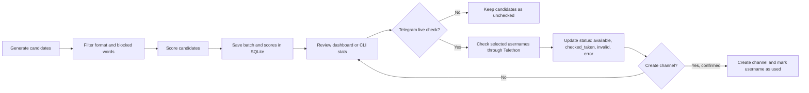

# Username Studio

[](https://www.python.org/)
[](https://docs.telethon.dev/)
[](https://www.sqlite.org/)
[](https://lmstudio.ai/)
[](https://www.microsoft.com/windows)

**Username Studio** is a local Python tool for generating, scoring, filtering, checking, and tracking short Telegram usernames.

The project combines a local LLM workflow through LM Studio, strict username validation, SQLite history, Telegram availability checks through Telethon, and a local browser dashboard. It is designed so that generation and database browsing are safe by default, while live Telegram actions stay behind explicit user choices and confirmation checks.

## Contents

- [What It Does](#what-it-does)
- [Quick Start](#quick-start)
- [Installation](#installation)
- [Configuration](#configuration)
- [Ways to Run](#ways-to-run)
- [How the Workflow Works](#how-the-workflow-works)
- [Telegram Safety Model](#telegram-safety-model)
- [Database and Statuses](#database-and-statuses)
- [Project Structure](#project-structure)
- [Troubleshooting](#troubleshooting)
- [Publishing Safety](#publishing-safety)

## What It Does

Username Studio helps you build a ranked pool of short Telegram username candidates and keep track of what happened to each one.

| Area | Details |
|---|---|
| Generation | Creates username candidates through LM Studio using an OpenAI-compatible local API. |
| Fallback generation | Continues working even if LM Studio is unavailable. |
| Evaluation | Scores candidates by readability, brandability, meaning, and rarity. |
| Filtering | Enforces the current project rule: `5-6` characters, lowercase latin letters only: `[a-z]`. |
| Telegram checks | Checks selected candidates through Telegram only when explicitly requested. |
| Channel creation | Can create a Telegram channel for an available username after confirmation. |
| Storage | Saves candidates, scores, batches, statuses, and used usernames in SQLite. |
| Interface | Provides both a local browser dashboard and an older console menu. |
| Logs | Writes runtime logs to `logs/logs.txt`. |

The generator currently works with three candidate styles:

| Generation type | Meaning |
|---|---|
| `brandable` | Short artificial names that should feel like brands. |
| `russian_transliteration` | Latin usernames inspired by Russian words or sounds. |
| `multilingual` | Short names inspired by words from different languages. |

## Quick Start

On Windows, the simplest way to start the project is the single launcher file:

```powershell
.\START.bat
```

The launcher:

- switches into the project directory;
- creates `venv` if it does not exist;
- creates `.env` from `.env.example` if needed;
- installs dependencies when `requirements.txt` changes;
- starts the local web interface through `main.py`;
- enables UTF-8 console output for readable Russian text.

For a safe no-Telegram smoke test:

```powershell
.\START.bat --no-telegram --dry-run --stats
```

For the old console menu:

```powershell
.\START.bat --cli
```

## Installation

If you do not want to use `START.bat`, set up the project manually:

```powershell
python -m venv venv
.\venv\Scripts\Activate.ps1
pip install -r requirements.txt
copy .env.example .env
python main.py
```

Minimum practical requirements:

| Requirement | Purpose |
|---|---|
| Python 3.10+ | Runtime for the application. |
| LM Studio | Optional but recommended local LLM generation and scoring. |
| Telegram API credentials | Required only for live Telegram checks and channel creation. |
| Windows PowerShell | Primary supported shell for the included launcher and publish script. |

Dependencies are intentionally small:

```text
telethon
requests
Unidecode
python-dotenv
```

## Configuration

Create `.env` from `.env.example` and fill in only what you need.

```env
TELEGRAM_API_ID=
TELEGRAM_API_HASH=
TELEGRAM_PHONE=
TELEGRAM_DRY_RUN=1

LM_STUDIO_URL=http://127.0.0.1:1234/v1
LM_STUDIO_MODEL=local-model
LLM_TEMPERATURE=0.95
LLM_MAX_TOKENS=2000

LOG_LEVEL=INFO
```

| Variable | Required | Description |
|---|---:|---|
| `TELEGRAM_API_ID` | Only for Telegram live mode | Numeric API ID from `https://my.telegram.org/`. |
| `TELEGRAM_API_HASH` | Only for Telegram live mode | API hash from Telegram. Keep it private. |
| `TELEGRAM_PHONE` | Only for Telegram live mode | Phone number used for Telethon login. |
| `TELEGRAM_DRY_RUN` | Recommended | `1` keeps Telegram actions in preview mode by default. |
| `LM_STUDIO_URL` | Optional | OpenAI-compatible LM Studio endpoint. |
| `LM_STUDIO_MODEL` | Optional | Model name sent to LM Studio. |
| `LLM_TEMPERATURE` | Optional | Generation randomness. |
| `LLM_MAX_TOKENS` | Optional | Maximum response size for LLM calls. |
| `LOG_LEVEL` | Optional | Logging verbosity. |

Telegram credentials can be created at:

```text
https://my.telegram.org/
```

LM Studio should expose an OpenAI-compatible server, usually at:

```text
http://localhost:1234/v1
```

If LM Studio is not running, the app still has fallback generation and fallback scoring logic.

## Ways to Run

| Command | Mode | Telegram |
|---|---|---|
| `.\START.bat` | Local web dashboard | Only when a live Telegram action is selected. |
| `.\START.bat --cli` | Console menu | Only in Telegram menu actions. |
| `.\START.bat --no-telegram --dry-run` | Safe preview mode | Disabled. |
| `.\START.bat --no-telegram --dry-run --stats` | Print stats and exit | Disabled. |
| `python main.py` | Web dashboard | Same as default launcher. |
| `python main.py --cli` | Console menu | Same as old workflow. |
| `python web_app.py` | Direct web dashboard | Same dashboard without going through `main.py`. |

The default app opens a local browser interface on:

```text
http://127.0.0.1:8080
```

You can change host and port:

```powershell
python main.py --host 127.0.0.1 --port 8090
```

## How the Workflow Works



The intended workflow is:

1. Generate and evaluate a batch.
2. Review the best candidates in the dashboard or stats view.
3. Run a dry-run Telegram preview first.
4. Check a small selected group live.
5. Create a channel only for a confirmed available username.

## Telegram Safety Model

Telegram actions are intentionally constrained.

| Safety behavior | Why it matters |
|---|---|
| Lazy Telegram connection | Opening the app does not immediately connect to Telegram. |
| `--no-telegram` flag | Fully disables Telegram actions for safe local browsing. |
| `dry-run` mode | Shows what would happen without sending Telegram requests. |
| Local validation first | Rejects usernames that do not match the current project rules. |
| Database status checks | Avoids reusing usernames already marked `used`, `invalid`, or `checked_taken`. |
| Confirmation before creation | Channel creation requires an explicit user confirmation. |
| FloodWait handling | Telegram rate-limit responses are handled with retry limits. |

The app should not be used for aggressive or large-scale Telegram probing. Keep checks small and deliberate.

## Database and Statuses

The project stores local state in:

```text
username_database.db
```

Main SQLite tables:

| Table | Purpose |
|---|---|
| `checked_usernames` | Telegram availability check results and current status. |
| `used_usernames` | Usernames already used for created channels. |
| `scores` | Latest scoring values for each username. |
| `batches` | Generation batch metadata. |
| `batch_usernames` | Username membership inside generated batches. |

Username statuses:

| Status | Meaning |
|---|---|
| `unchecked` | Candidate exists locally, but Telegram has not checked it yet. |
| `checked_taken` | Telegram indicates the username is taken or unavailable. |
| `available` | Telegram indicates the username is available. |
| `used` | Username has already been used for a channel. |
| `invalid` | Local validation or Telegram rejected the username. |
| `error` | A check failed, for example after FloodWait retries. |

Do not delete `username_database.db` unless you intentionally want to lose local history.

## Project Structure

| File | Purpose |
|---|---|
| `START.bat` | One-file Windows launcher. |
| `main.py` | Main entrypoint, web/CLI switch, generation workflow. |
| `web_app.py` | Local browser dashboard and HTTP API. |
| `config.py` | Environment loading and project constants. |
| `llm_generator.py` | LLM and fallback username generation. |
| `llm_evaluator.py` | LLM and fallback scoring. |
| `username_filter.py` | Username validation, blacklist, duplicate filtering. |
| `telegram_client.py` | Telethon integration for checks and channel creation. |
| `storage.py` | SQLite schema, migrations, records, stats. |
| `logger.py` | Console and file logging. |
| `utils.py` | Shared normalization, validation, and helper functions. |
| `requirements.txt` | Python dependencies. |
| `.env.example` | Safe configuration template. |
| `publish_to_github.ps1` | Safety-focused GitHub publication helper. |

Generated or private local files are ignored by Git:

```text
.env
*.session
*.db
*.bak
logs/
qa_screenshots/
venv/
__pycache__/
```

## Troubleshooting

### Russian text looks broken in the console

Use `START.bat`; it switches the console to UTF-8 and sets Python UTF-8 variables.

If running manually:

```powershell
chcp 65001
$env:PYTHONUTF8 = "1"
$env:PYTHONIOENCODING = "utf-8"
python main.py
```

### LM Studio is unavailable

Check that LM Studio is running an OpenAI-compatible server:

```text
http://localhost:1234/v1
```

The project can still generate and score through fallback logic, but LLM quality will be lower.

### Telegram login fails

Check `.env`:

```env
TELEGRAM_API_ID=
TELEGRAM_API_HASH=
TELEGRAM_PHONE=
```

If the local Telethon session is stale, use the dashboard session reset flow or remove the local session file only when you are ready to log in again.

### I only want to inspect data safely

Run:

```powershell
.\START.bat --no-telegram --dry-run --stats
```

or:

```powershell
.\START.bat --no-telegram --dry-run
```

### Show recent logs

```powershell
Get-Content logs\logs.txt -Tail 100
```

## Publishing Safety

This repository is safe to publish only because sensitive files are excluded.

Before pushing changes, verify that these files are not staged:

```text
.env
telegram_session.session
username_database.db
*.bak
logs/
qa_screenshots/
venv/
```

The included publishing helper performs these checks:

```powershell
.\publish_to_github.ps1
```

Commit and push after review:

```powershell
.\publish_to_github.ps1 -RepoUrl "https://github.com/sattop/username-studio.git" -Commit -Push
```

## Current Defaults

| Setting | Value |
|---|---|
| Username length | `5-6` characters |
| Username alphabet | lowercase latin letters, `[a-z]` |
| Score threshold | `6.0` |
| Default database | `username_database.db` |
| Default logs | `logs/logs.txt` |
| Default web host | `127.0.0.1` |
| Default web port | `8080` |
| Default Telegram session | `telegram_session.session` |

## Repository

```text
https://github.com/sattop/username-studio
```
